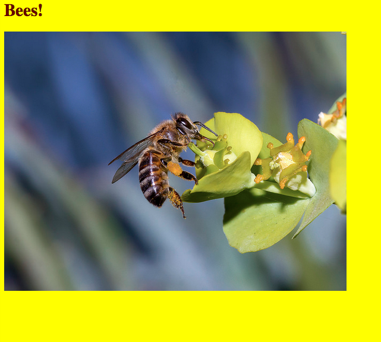

# Introduction to HTML and CSS

Websites are made up of many things, but HTML (Hyper Text Markup Language) and CSS (Cascading Style Sheets) are two of the most important components. Together, they are the building blocks for every single webpage on the Internet.

Think of a car. It, too, is made up of many attributes. Doors. Windows. Tires. Seats. In the world of HTML, these are the `elements` of a webpage. Meanwhile, each of the car's attrubutes are usually different. Perhaps they differ by size. Or color. Or wear and tear. These attributes are used to define how the `elements` look. Back in the world of webpages, CSS is used to define the look and feel of a webpage.

Now let's turn to an actual web page ..

## Requirements

Before we start, you need a *source code editor*, which is simply a text editor designed specifically for writing source code. Some popular editors include Notepade++ (Windows), TextMate (Mac), and Gedit (cross-platform). For this exercise, please download the cross-platform editor [Sublime Text](http://www.sublimetext.com/2), which is an open-source editor designed for simplicity and ease of use.

Also, please make sure you have [Google Chrome](http://google.com/chrome) installed.

## HTML

HTML gives a web pages structure, allowing you to view it from a web browser:

```html
<!DOCTYPE html>
<html>
  <head>
  	<title>My bumblebee website</title>
  	<link rel="stylesheet" href="styles.css">
  </head>
  <body>
    <h1 id="my-header">Bees!</h1>
    <p>
      <br/>
      
      <br>
    </p>
  </body>
</html>
```

> Copy and paste this HTML code into your text editor and save the file as "index.html".

Open the page in Chrome; it should look like this:


### Elements, Tags, and Atrributes

1. Tags form the structure of your page. They surround and apply *meaning* to content. There usually is an opening tag and then a closing tag, like - `<div></div>`, a divider. Some tags, like the `` (image) and `<br>` (line break) tags do not require a closing tag. Notice how I included one `<br>` tag with a `/` on the end. This was a best practice in previous versions of HTML. HTML5, on the other hand - the version we are using - is much more relaxed and does not require a `/`, but it will work fine with it as well. It's really the developer's preference.
2. Elements represent the tags as well as whatever falls between the opening and closing tag, like - `<title>My bumblebee website</title>`
3. Attributes (sometimes referred to as selectors) are used to select the tag for some purpose. In our case we are going to use them for defining styles, when we get to CSS. Selectors in most cases are either `id`s or `class`es. In the above example, notice the id `my-header`, which is associated with the `` tag. We'll look more at this later. Further, we also use the attributes `width="120"` and  `height="90"`. This can be defined using attributes directly withing the HTML or in the CSS stylesheet. Again, more on this later.

### What's going on?

Back to the HTML ..

1. The first line, `<!DOCTYPE html>` is the document type declaration, which tells the browser the version of HTML the page is using (HTML5, in our case). Without this, broswes can get confused, especially older versions of Internet Explorer. 
2. The `<head>` tag contains links to CSS stylesheets and Javascript files that we wish to use in our web page, as well as meta information used by search engines for clasification. In the above HTML, I used the `<title>` tag to give the web page a tile.
3. `<html>` is the first tag that informs the browser that all code that falls between the opening and closing, `</html>`, tag is HTML. 
4. All code that falls within the `<body>` tags are part the main content of the page, which will appear in the browser to the end user.
5. Headers: These include the `<h1>`, `<h2>`, `<h3>`, `<h4>`, `<h5>` and `<h6>` tags. `<h1>` is the main heading and the reamining headings decrease in size, with `<h6>` beging the smallest. It's best practice to use the `<h1>` tage once per page, while the other tags can be used any number of times, but they should always be in order. In other words, `<h3>` should be a sub-heading of `<h2>` and `<h4>` should be a sub-heading of `<h3>`. Can you recognize the header in the HTML. 
6. Paragraphs: The `<p>` tag is used for splitting content literally into seperate pargarphs. Each new `<p>` tag will appear on a new line.

### Additional Tags

Two additional tags are lists (ordered `<ol>` and unordered `<ul>`) as well as links `<a href>`. Look these up on your own. Mozilla has an excellent reference guide [here](https://developer.mozilla.org/en-US/docs/Web/Guide/HTML/HTML5/HTML5_element_list).

### Putting it all together.

Let's add all the tags that were discussed.

```html
<html>
  <head>
    <title>My bumblebee website</title>
    <link rel="stylesheet" href="styles.css">
  </head>
  <body>
    <h1 id="my-header">Bees!</h1>
    <h2>Wonder, wonderful bumblebees</h2>
    <p>
      <br/>
      
      <br>
    </p>
    <h2>About the Bumblebee</h2>
      <h3>(From <a href="http://en.wikipedia.org/wiki/Bumblebee">Wikipedia)</a></h3>
      <p>A bumblebee is any member of the bee genus Bombus, in the family Apidae. There are over 250 known species, existing primarily in the Northern Hemisphere although they also occur in South America. They have been introduced to New Zealand and the Australian state of Tasmania.</p>
      <p>Bumblebees are social insects that are characterised by black and yellow body hairs, often in bands. However, some species have orange or red on their bodies, or may be entirely black. Another obvious (but not unique) characteristic is the soft nature of the hair (long, branched setae), called pile, that covers their entire body, making them appear and feel fuzzy. They are best distinguished from similarly large, fuzzy bees by the form of the female hind leg, which is modified to form a corbicula: a shiny concave surface that is bare, but surrounded by a fringe of hairs used to transport pollen (in similar bees, the hind leg is completely hairy, and pollen grains are wedged into the hairs for transport).</p>
    <br>
    <h2>Types of Bees:</h2>
      <ol>
        <li>Southern plains bumblebee</li>
        <li>New garden bumblebee</li>
        <li>Early bumblebee</li>
        <li>Orange-belted bumblebee</li>
        <li>Buff-tailed bumblebee or large earth bumblebee</li>
      </ol>
  </body>
</html>
```

Check it out in your browser. Add some more elements, or let's move on to CSS so we can make the site look better.

On to CSS ..

## CSS

While HTML provides, structure, CSS is used for styling, making webpages look nice. From the size of the text to the background colors to the positionging of HTML elements, CSS gives you control over almost every visual aspect of a page.


CSS and HTML work in tandem. CSS styles (or rules) are applied directly to HTML elements. For example, remember this element from above - `<h1 id="my-header">Bees!</h1>`. Well, since their is an `id` selector associated with it, we can assign CSS styles to it using an external stylesheet.

```css
#my-header {
  color: #660000;
}
```

> Save this as "styles.css".

Next, we need to "link" our HTML page and CSS stylesheet. To do so, add the following code to the `<head>` section of the HTML page just below the tile:

```html
<link rel="stylesheet" href="styles.css">
```

Your code should now look like this:

```html
<html>
  <head>
  	<title>My bumblebee website</title>
  	<link rel="stylesheet" href="styles.css">
  </head>
  <body>
    <h1 id="my-header">Bees!</h1>
    <p>
      
    </p>
  </body>
</html>
```

Then save the file as. Check it out in your browser:


See the difference? Yes, it's subtle - but the `<H1>`, or header, is a maroon color.

You can also change certain elements even if they are not *explicitly* found within the HTML of the page, like the background color.

Update your CSS file. Make sure to save it.

```css
body {
  background-color: #FFFF00
}

#my-header {
  color: #660000;
}
```



What do you think? Good. Bad. Ugly? Go ahead and change the color of the background and header on your end. The [color picker](http://color.hailpixel.com/) is nice for this. [Update](http://www.flickr.com/) the picture, too, if you want. 

## Your turn!

1. Add a header (H1)
2. Create an order list
3. Change the background color and font size
4. Style the list


## Inspecting a Web Site

Chrome Developer Tools

## Extra Credit
